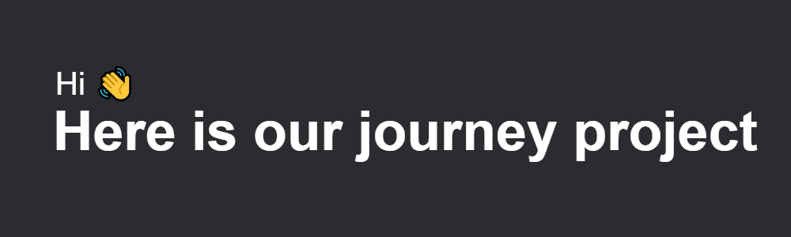

# Проект: Путешествие по России

[![Typing SVG](https://readme-typing-svg.demolab.com?font=Inter&size=25&duration=4000&pause=50&width=600&height=40&lines=%D0%9F%D1%80%D0%B8%D0%B2%D0%B5%D1%82!+;%D0%9F%D0%B5%D1%80%D0%B5%D0%B4+%D0%B2%D0%B0%D0%BC%D0%B8+%D0%BF%D1%80%D0%BE%D0%B5%D0%BA%D1%82+%D0%BE+%D0%BF%D1%83%D1%82%D0%B5%D1%88%D0%B5%D1%81%D1%82%D0%B2%D0%B8%D0%B8+%D1%87%D0%B5%D1%80%D0%B5%D0%B7+%D0%B2%D1%81%D1%8E+%D0%A0%D0%BE%D1%81%D1%81%D0%B8%D1%8E;%D0%98+%D1%82%D0%B0%D0%BA...+%D0%B2+%D0%BF%D1%83%D1%82%D1%8C!;%D0%9F%D1%81%D0%BA%D0%BE%D0%B2;%D0%92%D0%B5%D0%BB%D0%B8%D0%BA%D0%B8%D0%B9+%D0%9D%D0%BE%D0%B2%D0%B3%D0%BE%D1%80%D0%BE%D0%B4;%D0%A2%D0%B2%D0%B5%D1%80%D1%8C;%D0%AF%D1%80%D0%BE%D1%81%D0%BB%D0%B0%D0%B2%D0%BB%D1%8C;%D0%9C%D0%B0%D0%BD%D1%82%D1%83%D1%80%D0%BE%D0%B2%D0%BE;%D0%9A%D0%BE%D1%82%D0%B5%D0%BB%D1%8C%D0%BD%D0%B8%D1%87-1;%D0%93%D0%BB%D0%B0%D0%B7%D0%BE%D0%B2;%D0%9F%D0%B5%D1%80%D0%BC%D1%8C;%D0%95%D0%BA%D0%B0%D1%82%D0%B5%D1%80%D0%B8%D0%BD%D0%B1%D1%83%D1%80%D0%B3;%D0%A2%D1%8E%D0%BC%D0%B5%D0%BD%D1%8C;%D0%9E%D0%BC%D1%81%D0%BA;%D0%9A%D1%80%D0%B0%D1%81%D0%BD%D0%BE%D1%8F%D1%80%D1%81%D0%BA;%D0%A3%D0%BB%D0%B0%D0%BD-%D0%A3%D0%B4%D1%8D;%D0%90+%D1%81%D0%BA%D0%BE%D0%BB%D1%8C%D0%BA%D0%BE+%D0%B8%D0%BD%D1%82%D0%B5%D1%80%D0%B5%D1%81%D0%BD%D1%8B%D1%85+%D0%B8+%D0%B6%D0%B8%D0%B2%D0%BE%D0%BF%D0%B8%D1%81%D0%BD%D1%8B%D1%85+%D0%BC%D0%B5%D1%81%D1%82!)](https://git.io/typing-svg)
## О проекте
Перед вами одностраничный сайт, выполненный в рамках обучения в Яндексе Практикуме
по программе Веб-разработчик.
Проект создавался в течение второго курса обучения: октябрь 2022 года.

*Ссылка на сайт проекта:*
https://eliseye.github.io/russian-travel/index.html

Благодаря команде, подготовившей контент и дизайн,
на сайте вы можете узнать:

* Чего мы там не видели;
* О Куршской косе;
* О Кольском;
* Об Алтае;
* Про зимний Байкал и как до него добраться "на собках";
* О Карелии.

## Технологии

Проект реализован на основе таких технологий как:

* Языки программирования: HTML, CSS;  
* БЭМ;
* Файловая структура БЭМ (Nested);
* Flex-блоки;
* Grid Layout;
* Реализована адаптивность интерфейса благодаря использованию медиазапросов - директивы *media*
  с контрольными размерами экрана 1280px, 1024px, 768px, 320px;
* Анимация декоративных элементов и элементов управления.

## Функциональность

* Возможеность открывать страницу на устройствах различной шириной от 320px
  Таким образом, страницу удобно читать как с экрана компьютера, так и с экранов мобилных устройств;
* Активные ссылки: На сервисы Яндекса.
